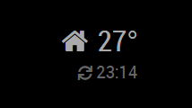
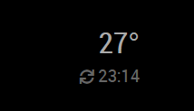

# MMM-RemoteTemperature

This is a module for the [MagicMirror²](https://github.com/MichMich/MagicMirror/) to display temperature and humidity values from a remote sensor that is capable to POST the measured values through HTTP protocol.

## Features

By default this module displays the measured temperature, humidity, an icon and the time of the last update:


If the sensor does not send humidity data, then only the temperature is displayed:



You can configure the module to display a custom icon:


If you wish, you can completely remove the icon:



You can also hide the timestamp:


This module is capable to display only a single temperature value. If you would like to see the value of more sensors on your mirror, add this module multiple times.

For updates, please check the [CHANGELOG](https://github.com/balassy/MMM-RemoteTemperature/blob/master/CHANGELOG.md).

## Using the module

To use this module follow these steps:

1. Clone this repository to the `modules` folder of your MagicMirror:

```bash
git clone https://github.com/balassy/MMM-RemoteTemperature.git
```

2. Install the 3rd party dependencies:

```bash
npm install
```

3. Add the following configuration block to the modules array in the `config/config.js` file:

```js
var config = {
  modules: [
    {
      module: 'MMM-RemoteTemperature',
      position: 'top_right',
      config: {
        sensorId: '1',
        icon: 'home',
        showTime: true
      }
    }
  ]
}
```

**!! IMPORTANT !!**

For security reasons the MagicMirror is *not* reachable externally, which also means that it does not accept data from external sources. Make sure you configure the `ipWhitelist` setting in the `config.js` file (see [these lines in the sample config](https://github.com/MichMich/MagicMirror/blob/master/config/config.js.sample#L18-L22)) correctly, so the remote sensor can communicate with your mirror.

## Configuration options

| Option     | Description
|------------|-----------
| `sensorId` | **REQUIRED** An arbitrary value that determines from which sensor this module accepts updates. It can also be used as an API key to restrict access to your mirror.<br><br> **Type:** `string` <br>**Default value:** `null` (must be configured)
| `icon`     | *Optional* Name of a [FontAwesome icon](https://fontawesome.com/icons?d=gallery) that is displayed before the temperature value. For example set to `'home'` to indicate that the mirror displays an indoor value or `'car'` if you show the temperature your car enjoys in the garage. You can set it to `null` to not display any symbol. <br><br> **Type:** `string` <br>**Default value:** `'home'`
| `showTime` | *Optional* Determines whether the timestamp of the last data update should be displayed on the mirror. <br><br> **Type:** `boolean` <br>**Default value:** `true`

## How it works

This module creates a new HTTP endpoint on the mirror's webserver, which handles HTTP POST requests sent by the remote sensors. The HTTP request must contain the temperature data measured by the sensor and the unique identifier you assigned to the sensor. The module displays the measured value only if the configured `sensorId` matches the value received in the request.

It is up to the sensor to define how often it updates the measured data, the mirror will display the last received value.

## Sensor requirements and communication

This module can work with any temperature sensor that is capable to periodically send HTTP POST requests with the following standard JSON body to the `http://<your mirror's IP>:8080/remote-temperature` endpoint:

```javascript
{
  "temp": 27,
  "humidity": 30.4,
  "sensorId": "1"
}
```

The `temp` property value must be a `number`, and must contain the measured temperature. It will be displayed on the mirror as is, without any conversion, appended by the `°` symbol.

The `humidity` property value is optional, but if specified, it must be a number, and must contain the measured humidity represented in percentage. It will be displayed on the mirror as is, without any conversion, appended by the `%` symbol.

The `sensorId` property must be a `string`, and can contain any value, but it is important that it must match the `sensorId` specified for the module in the configuration. It is used to determine which module should display the value, if the module is added multiple times to the mirror. It can also be used as an API key to ensure that only authorized sensors can update the mirror.

Make sure that your sensor properly sets the `Content-Type` header in the HTTP request to `application/json`, otherwise the module will not be able to parse the request body.

## Localization

Currently this module supports English (`en`) and Hungarian (`hu`) languages. The language can be specified in the global `language` setting in the `config.js` file.

Want to see more languages? Please contribute!

## Customizing the design

You can customize the look and feel of the module via the following CSS classes (from version 1.2.0):

- `symbol`: The style of the icon.
- `temp`: The style of the temperature value.
- `humidity`: The style of the humidity value (if specified and rendered).
- `time`: The style for the timestamp (if configured to show).

## Contribution

Although for operation this module does not depend on any other module, if you would like to contribute to the codebase, please use the preconfigured linters to analyze the source code before sending a pull request. To run the linters follow these steps:

1. Install developer dependencies:

```bash
npm install
```

2. Install Grunt:

```bash
npm install -g grunt
```

3. Use Grunt to run all linters:

```bash
grunt
```

## Got feedback?

Your feedback is more than welcome, please send your suggestions, feature requests or bug reports as [Github issues](https://github.com/balassy/MMM-RemoteTemperature/issues).

## Acknowledments

Many thanks to [Michael Teeuw](https://github.com/MichMich) for creating and maintaining the [MagicMirror²](https://github.com/MichMich/MagicMirror/) project fully open source.

## About the author

This project is created and maintained by [György Balássy](https://www.linkedin.com/in/balassy).
